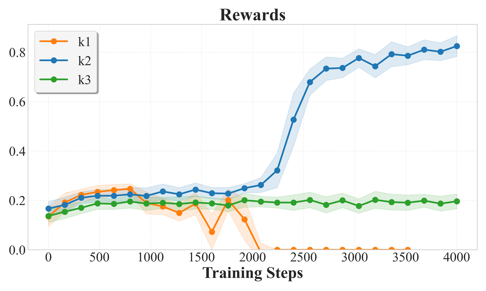

# Principled RL for Diffusion LLMs Emerges from a Sequence-Level Perspective
[](https://arxiv.org/abs/2512.03759)
[](https://huggingface.co/collections/GSAI-ML/espo)
[](https://jingyangou.github.io/ESPO-Demo/)
---
## Introduction

We introduce **ESPO (ELBO-based Sequence-level Policy Optimization)**, a principled reinforcement learning framework for dLLMs.  

Unlike traditional autoregressive RL methods (e.g., GRPO) that rely on token-level likelihoods, ESPO views the **entire sequence generation as a single action** and leverages the **ELBO** as a tractable proxy for sequence-level likelihood. This design resolves the fundamental mismatch between RL and the non-autoregressive nature of dLLMs.

ESPO introduces:
- **Sequence-level optimization** for diffusion LLMs via the ELBO objective.
- **Per-token normalized ratio estimation** and **robust KL regularization** for stable large-scale training.
- **Consistent gains** across math, coding, and planning benchmarks.

<div style="display: flex; justify-content: center; flex-wrap: wrap;">
    
    
</div>

---


## Repository Layout

```
├── espo/
│   ├── espo_train.py          # Entry point for diffusion RL training
│   ├── espo_trainer.py        # Sequence-level trainer implementation
│   ├── configs.py             # Configuration schemas and defaults
│   ├── rewards.py             # Reward functions for different tasks
│   ├── data_utils.py          # Data loading and processing utilities
│   └── utils/                 # Helpers (code exec, routing, logging)
├── recipes/
│   ├── train.yaml             # Base training configuration
│   ├── run_*.sh               # Task-specific launch scripts (GSM8K, Math, etc.)
│   ├── process_data.py        # Dataset preprocessing for coding tasks
│   ├── accelerate_configs/    # accelerate/distributed launch presets
├── dataset/                   # Datasets for Sudoku and Countdown tasks
├── eval/                      # Evaluation scripts for Sudoku and Countdown tasks
```

## Installation

```bash
env=espo
conda create -n $env python=3.11 -y
conda activate $env
pip install setuptools
pip install flash-attn==2.8.0.post1 --no-build-isolation
# Install this project. Extras available: [code]
pip install -e ".[code]"
```

## Optional: Code Task Preparation

We split a hard subset based on [AceCode-89k](https://huggingface.co/datasets/TIGER-Lab/AceCode-87K).:

```bash
cd recipes
python process_data.py --dataset_path "TIGER-Lab/AceCode-89K" --output_path "./acecode_hard.jsonl" --difficulty "hard"
```

For sandboxed code execution, we recommend [E2B](https://e2b.dev/). Set `E2B_API_KEY` to your token and specify `code_provider="e2b"` in the config. A local fallback `code_provider="local"` is available but not recommended for untrusted code.

## Checkpoints 
We release ESPO-fine-tuned checkpoints built on LLaDA-8B-Instruct.

ESPO-Code is released as a full fine-tuned model (no LoRA). ESPO-GSM8K, ESPO-Math, ESPO-Countdown, and ESPO-Sudoku are provided as LoRA adapters, which can be loaded on top of the base LLaDA-8B-Instruct model for lightweight and efficient fine-tuning.

Quick Start:
```python
from transformers import AutoModelForCausalLM, AutoTokenizer
from peft import PeftModel
from eval.generate_utils import generate
base_model_path = 'GSAI-ML/LLaDA-8B-Instruct'
peft_model_path = 'GSAI-ML/ESPO-Math'
tokenizer = AutoTokenizer.from_pretrained(base_model_path)
model = AutoModelForCausalLM.from_pretrained(
    base_model_path, trust_remote_code=True,torch_dtype="bfloat16", device_map="cuda")
peft_model = PeftModel.from_pretrained(model, peft_model_path, device_map="cuda")
prompt = "The point $(0,0)$ is reflected over the vertical line $x=1$.  When its image is then reflected over the line $y=2$, what is the resulting point?\n\nWrite your answer in the form $(x, y)$ where $x$ and $y$ are real numbers."
messages = [{"role": "user", "content": prompt}]
input_ids = tokenizer.apply_chat_template(messages, return_tensors="pt").to("cuda")
output_ids = generate(peft_model, input_ids,tokenizer, steps=128,    gen_length=256, temperature=0.9,remasking="low_confidence",)
output_text = tokenizer.batch_decode(output_ids[:, input_ids.shape[1]:], skip_special_tokens=True)[0]
print(output_text)
```

## Training

We provide RL training scripts in the `recipes` directory.

Example:

```bash
bash recipes/run_demo_llada.sh
```

For **LLaDA-8B-Instruct**, we include both a **demo script** and **task-specific scripts** for GSM8K, Math, Countdown, Sudoku, and Coding.
For **Dream-7B-Instruct**, we provide a **demo script** (`run_demo_dream.sh`), and all task scripts can be easily adapted by modifying the parameters in this demo. You may also customize settings directly in the corresponding `run_*.sh` files or in `train.yaml`.


### Tips for Memory Optimization
  For large batch sizes or full-parameter finetuning (e.g., code tasks), enable `gradient_checkpointing: true` in the config. For LLaDA models, add the following methods in the end of `modeling_llada.py`:
```python
    ...
    def tie_weights(self):
        if self.config.weight_tying:
            self.model.transformer.ff_out = self.model.transformer.wte

    # Add the following codes in modeling_llada.py.
    ## Begin
    @property
    def supports_gradient_checkpointing(self):
        return True

    def gradient_checkpointing_enable(self, gradient_checkpointing_kwargs=None):
        self.model.set_activation_checkpointing("fine_grained")

    def gradient_checkpointing_disable(self):
        self.model.set_activation_checkpointing(None)
    ## End

# Register the model so that it is available for transformer pipelines, auto-loading, etc.
AutoModel.register(LLaDAConfig, LLaDAModelLM)
```
  Use `fine_grained` strategy balances speed and memory.

## Evaluation
<!-- - Sudoku and Countdown: use scripts from [d1](https://github.com/dllm-reasoning/d1). -->
For Sudoku and Countdown tasks, we provide evaluation scripts in `eval/run_eval.sh`. It works for both Dream-7B-Instruct and LLaDA-8B-Instruct. 

For GSM8K, Math, and Code tasks, we use the official evaluation scripts from the respective model codebases:

- LLaDA-8B-Instruct: use their official [evaluation script](https://github.com/ML-GSAI/LLaDA/tree/main/opencompass) based on opencompass.
- Dream-7B-Instruct: use their official [evaluation script](https://github.com/DreamLM/Dream/tree/main/eval_instruct) based on lm-eval.


## Acknowledgements

We thank the following open-source efforts:
- Models: [LLaDA](https://github.com/ML-GSAI/LLaDA), [Dream](https://github.com/HKUNLP/Dream)
- RL/eval codebases: [d1](https://github.com/dllm-reasoning/d1), [Diffu-coder](https://github.com/apple/ml-diffuCoder), [Open-R1](https://github.com/huggingface/open-r1), [Opencompass](https://github.com/open-compass/opencompass)

## Citation
If you find ESPO useful in your research, please consider to cite our paper:


```bibtex
@article{ou2025principledrldiffusionllms,
      title={Principled RL for Diffusion LLMs Emerges from a Sequence-Level Perspective}, 
      author={Jingyang Ou and Jiaqi Han and Minkai Xu and Shaoxuan Xu and Jianwen Xie and Stefano Ermon and Yi Wu and Chongxuan Li},
      journal={arXiv preprint arXiv:2512.03759},
      year={2025},
}
```